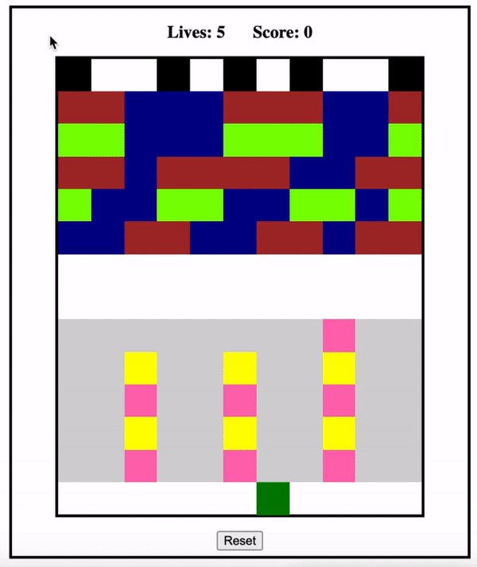

# 🐸 FROGGER 🐸

# Summary

* Seven-day solo build of a browser-based version of a classic arcade game.

* My first JavaScript coding project, ever, after learning the language for three weeks. Click to [play](https://zarathustrah.github.io/FROGGER/)

<hr style="2px solid gray"> </hr>

# Technologies

* JavaScript
* CSS
* HTML
* Git
* GitHub

<hr style="2px solid gray"> </hr>

# The Game

* The aim of Frogger is to guide your frog from one end of the screen to the other, using arrow keys, while avoiding lethal obstacles and treacherous waters. 

* The player accumulates points every time the frog moves, and by getting the frog to safety. 

* If the frog gets creamed by a car or plunges into the pond, it's curtains and you lose a life (look after your frogs. Always). The game ends when you run out of lives or successfully navigate all the frogs home.

<hr style="2px solid gray"> </hr>

# Planning

This was a lesson in learning the hard way: eager to get stuck into the project, I underestimated the task and didn't formulate a proper and detailed approach to it. Consequently, it was considerably more challenging than it needed to have been.

Nevertheless, the experience taught me how important it is to plan your code thoroughly and have a clear roadmap for the build. 

After a spectacular false start, I went back to the beginning and broke the process down into granular detail.

<hr style="2px solid gray"> </hr>

# Development Process

* Setting a goal for MVP: Having rushed in headfirst and finding myself lost, I decided to define a concrete goal of building a simple but functional single-level game in which the player could accumulate a score and win or lose, and reset the game.  

* Clinging desperately to the analogue world (I'm happy to say that I am now a digital evangelist) , I drew a grid with pencil and paper and marked up the components of the game: player, obstacles, platforms, bases, movement, win/loss conditions, scoring.  

* I then concentrated on how to translate these elements into JavaScript code. **I wanted to prioritise making the code do the work** as opposed to the (then) tempting familiarity of hard-coding. Accordingly, 
**I focused on understanding and using arrays and array methods** to build the game.

<hr style="2px solid gray"> </hr>

# Architecture 

<p align="center">
  
</p>

* The basis of the game components is a series of arrays:

```
let playerIndex = [148]
let obstaclesLeft = [142, 139, 136, 120, 117, 114, 98]
let obstaclesRight = [121, 124, 127, 99, 102, 105]
let platformsLeft = [65, 64, 61, 60, 57, 56, 42, 41, 40, 39, 37, 36, 35, 34, 21, 20, 19, 15, 14, 13 ]
let platformsRight = [44, 45, 48, 49, 51, 52, 24, 25, 26, 29, 30, 31]
```

* The game board itself and all of its components are generated by a series of functions that loop through their respective arrays:

```
function createGrid() {
    for (let i = 0; i < gridCellCount; i += 1) {
      const cell = document.createElement('div')
      cells.push(cell)
      grid.appendChild(cell)
    }
```

```
function displayObstacles() {
    cells.forEach(cell => cell.classList.remove('obstacle-left', 'obstacle-right'))
    obstaclesLeft.forEach(obstacle => cells[obstacle].classList.add('obstacle-left'))
    obstaclesRight.forEach(obstacle => cells[obstacle].classList.add('obstacle-right'))    
    displayRoad()
  }
  
  function displayPlatforms() {
    cells.forEach(cell => cell.classList.remove('platform-left', 'platform-right'))
    platformsLeft.forEach(platform => cells[platform].classList.add('platform-left'))
    platformsRight.forEach(platform => cells[platform].classList.add('platform-right'))
    displayWater()

```
**Movement**

* To animate the moving components (obstacles and platforms), I wrote a function to map their respective arrays and instruct the value in the array to increment or decrement. I then applied a timer using the setInterval() method to set the animation loop:

```
 function moveObstacles() {
    obstaclesLeft = obstaclesLeft.map(obstacle => {
      if (obstacle % width > 0) {
        return obstacle - 1
      } else {
        return obstacle + (width - 1)
      }
    }) 
```
```
moveObstacles()
    moveObstaclesInterval = setInterval(moveObstacles, 500)

```
<hr style="2px solid gray"> </hr>

# Challenges

* As my first JavaScript coding project, this was a daunting challenge. Starting out initially without a proper plan led me down some strange programming paths - including writing functions to add and remove every single component individually. However, after restarting my approach and really *thinking* about the task, it became more obtainable. 

* Making the code do the work: conceptually, this was initially difficult to grasp during the first few weeks of learning JavaScript. However, focuing on understanding loops helped clarify the programatic approach to coding. 

<hr style="2px solid gray"> </hr>

# Wins

* Achieving MVP was a huge win. While I didn't have time to style the game, the fact that it works and is almost bug-free (currently you can guide the frog to the same base and win the game, rather than having to reach each base individually) is very satisfying. 

* Learning about the callstack and calling functions within other functions was a big takeaway. I wrote code that resulted in the infamous stack overflow and spent a lot of time figuring a way out!

<hr style="2px solid gray"> </hr>

# Future Improvements

* Styling
* Difficulty (e.g. beginner, intermediate, advanced)
* Levels and progression
* High score function 

